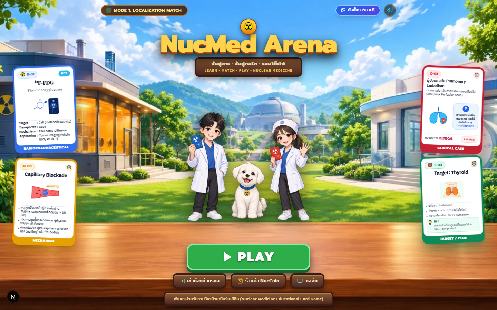
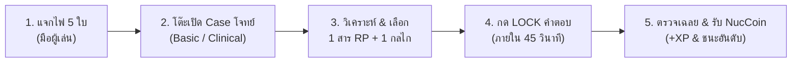
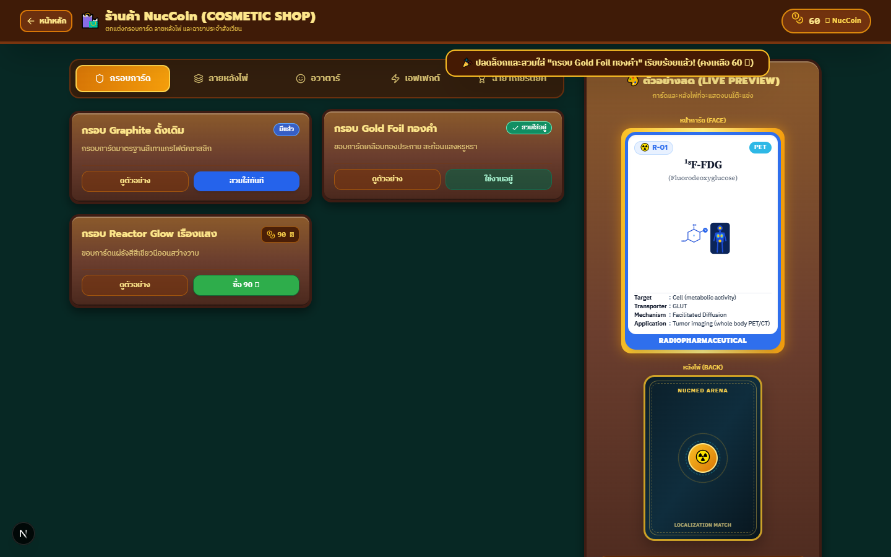

# NucMed Arena — Mode 1: Localization Match ☢️🃏

<div align="center">



[](https://nextjs.org/)
[](https://react.dev/)
[](https://www.typescriptlang.org/)
[](https://tailwindcss.com/)
[](https://github.com/PhumshopRT/-Nu-Med-Arena)

**เกมไพ่การศึกษาแพทย์นิวเคลียร์ (Nuclear Medicine Educational Card Game)**  
*พัฒนาขึ้นสำหรับรายวิชานิวเคลียร์เมดิซีน เพื่อการเรียนรู้กลไกการสะสมของสารเภสัชรังสีผ่านประสบการณ์บอร์ดเกมบนเว็บแบบเรียลไทม์*

[🎮 เข้าสู่สังเวียนการประลอง (Live Web Demo)](https://phumshoprt.github.io/-Nu-Med-Arena/) · [📖 วิธีการเล่น](#-วิธีการเล่น-how-to-play) · [🧪 สรุปกลไก 12 ชนิด](#-สรุป-12-กลไกการสะสมของสารเภสัชรังสี-mechanism-cheat-sheet) · [📱 การรองรับอุปกรณ์](#-รองรับทุกอุปกรณ์-responsive-design)

</div>

---

## 🌟 จุดเด่นและเรื่องราวของเกม (Story & Lore)

> **"ในค่ำคืนที่เตาปฏิกรณ์นิวเคลียร์กำลังผลิตไอโซโทปรังสี... คุณคือแพทย์นิวเคลียร์รุ่นใหม่ที่ก้าวเข้าสู่ห้องแล็บโต๊ะประลองไพ่คาสิโน!"**

ผู้เล่นจะได้รับไพ่สารเภสัชรังสี (Radiopharmaceuticals) ประจำตัว และต้องแข่งขันกันวิเคราะห์อาการผู้ป่วยในแต่ละรอบ เพื่อจับคู่ **"สารรังสีที่ถูกต้อง"** และ **"กลไกการสะสมทางสรีรวิทยา (Localization Mechanism)"** ลงบนโต๊ะประลองแข่งขันกับเวลา พร้อมระบบ AI Bot จำลองผู้ร่วมแข่ง และสะสมเหรียญ **NucCoin** เพื่อแลกของรางวัลตกแต่ง!

<div align="center">
  <a href="https://github.com/PhumshopRT/-Nu-Med-Arena/blob/main/docs/screenshots/play_table.png">
    
  </a>
  <p><sub>ภาพตัวอย่างการเล่นจริง · เปิดภาพต้นฉบับได้โดยคลิกที่ภาพ</sub></p>
</div>

---

## 🃏 โครงสร้างสำรับไพ่ 4 สีมหัศจรรย์ (The 4 Sacred Decks)

| หมวดการ์ด | สีประจำหมวด | หน้าที่ในเกม | ตัวอย่างในการ์ด |
| :--- | :---: | :--- | :--- |
| **🔵 RP Card** | **น้ำเงิน** | **สารเภสัชรังสี (Radiopharmaceutical)**<br>ระบุไอโซโทป รังสีที่ปล่อย เครื่องตรวจ (SPECT/PET) และอวัยวะเป้าหมาย | ⁹⁹ᵐTc-MAA, ¹⁸F-FDG, ¹²³I-NaI, ⁹⁹ᵐTc-MDP, ⁹⁹ᵐTc-Sestamibi |
| **🟡 Mechanism Card** | **เหลือง** | **กลไกการสะสม (Mechanism of Localization)**<br>กระบวนการทางสรีรวิทยาและชีวเคมีที่ทำให้สารจับในอวัยวะ | Capillary Blockade, Active Transport, Phagocytosis, Receptor Binding |
| **🔴 Case Card** | **แดง** | **โจทย์ทางคลินิก (Clinical Case)**<br>อาการผู้ป่วย ข้อบ่งชี้ และภาพสเกตช์อวัยวะ | C-01 Bone Scan, C-05 Suspected PE, C-11 Thyroid Nodule |
| **🟢 Clue / Target Card** | **เขียว** | **คำใบ้และอวัยวะเป้าหมาย (Organ Target)**<br>ภาพวาดอวัยวะแบบ Flat Vector ช่วยชี้นำคำตอบเมื่อเวลาเหลือครึ่งหนึ่ง | ต่อมไทรอยด์ผีเสื้อ, ปอดสองข้าง, โครงกระดูก, ตับและม้าม |

---

## 🎮 วิธีการเล่น (How to Play)



### 1. ช่วงแจกการ์ด (Deal Phase)
ผู้เล่นทุกคนจะได้รับไพ่สารเภสัชรังสี (RP Card) สุ่มขึ้นมือคนละ **5 ใบ** โดยการ์ดในมือจะจัดเรียงเป็นพัดโค้งสวยงามที่ด้านล่างของหน้าจอ

### 2. วิเคราะห์โจทย์ผู้ป่วย (Case Reveal) & ใบคำใบ้ส่วนตัว (Private Clue)
ในแต่ละรอบ โต๊ะจะเปิดการ์ดโจทย์ทางคลินิกตรงกลาง:
- **🟢 BASIC:** โจทย์ระบุชื่อการตรวจหรืออวัยวะตรงๆ (เช่น *Bone Scan*, *Thyroid Uptake*)
- **🔴 CLINICAL:** โจทย์บรรยายอาการผู้ป่วย ผลแล็บ หรือโรคทางคลินิก (เช่น *สงสัย Pulmonary Embolism*, *Pediatric Meckel's Diverticulum*)

> 💡 **การเปิดใบคำใบ้สีเขียวส่วนตัว (Private Clue):**
> - ผู้เล่นสามารถกดปุ่ม **«เปิดคำใบ้ -1 ถ้าตอบถูก»** ทางด้านซ้าย พร้อมป็อปอัปยืนยันก่อนเปิด
> - **การมองเห็นส่วนตัว:** คำใบ้จะแสดงเฉพาะบนหน้าจอของผู้เล่นที่กดเปิดเท่านั้น โดยผู้เล่นคนอื่นและจอฉายห้องเรียน (Projector View) จะมองไม่เห็น และ AI Bot จะไม่เปิดคำใบ้
> - เมื่อยืนยันเปิดแล้ว **จะไม่สามารถปิดกลับได้ในรอบนั้น**

### 3. เลือกคู่สารและกลไก (Match & Lock)
- แตะเลือก **ไพ่สารเภสัชรังสี (RP)** 1 ใบจากมือด้านล่าง
- แตะเลือก **กลไกการสะสม (Mechanism)** 1 อย่างจากแถบกลไกกลางโต๊ะ (มีปุ่มเลื่อนสไตล์เกมคอนโซล ◀ ▶)
- การ์ดทั้งสองจะลอยเข้าสู่ช่อง **"คำตอบของคุณ (YOUR MATCH)"**
- กดปุ่มทองคำ 🔒 **LOCK คำตอบ!** ก่อนเวลานับถอยหลัง 45 วินาทีจะหมด

### 4. ตรวจเฉลยและสูตรการคิดคะแนน (Grading Formula & Rationale)
การตรวจคำตอบยังคงตรวจสอบความถูกต้องทั้ง **สารเภสัชรังสี (acceptedRpIds)** และ **กลไกการสะสม (acceptedMechIds)** ควบคู่กัน:

| ระดับโจทย์ (Case Difficulty) | ตอบถูก (ไม่เปิดคำใบ้) | ตอบถูก (เปิดคำใบ้ส่วนตัว) | ตอบผิด / ไม่ครบ |
| :--- | :---: | :---: | :---: |
| 🟢 **BASIC** | **8 คะแนน** | **7 คะแนน** (-1 แต้ม) | **0 คะแนน** |
| 🔴 **CLINICAL** | **16 คะแนน** | **15 คะแนน** (-1 แต้ม) | **0 คะแนน** |

- *หักแต้มเฉพาะผู้เล่นที่เปิดคำใบ้เท่านั้น และหากตอบผิดจะได้ 0 คะแนนเท่าเดิม (ไม่มีคะแนนติดลบ)*
- *ระบบบันทึกบัญชีนักศึกษาด้วยรหัสผ่านลงใน `na_accounts` พร้อมระบบแผงบริหารจัดการสำหรับอาจารย์ผู้สอน (Admin Panel)*
- *รางวัล NucCoin: เข้าเส้นชัยรับ 5 NucCoin, ชนะเลิศอันดับ 1 รับ 20 NucCoin, เสมออันดับ 1 รับ 10 NucCoin (เริ่มต้น 120 NucCoin)*

### 5. ช่วงเปลี่ยนไพ่ (Hand Swap Phase)
เมื่อจบรอบ ผู้เล่นสามารถเลือกทิ้งการ์ดที่ไม่ถนัดเพื่อจั่วการ์ดใหม่จากกองสำรับได้ฟรี 1 ครั้งก่อนขึ้นรอบถัดไป!

---

## 🧪 สรุป 12 กลไกการสะสมของสารเภสัชรังสี (Mechanism Cheat Sheet)

| รหัส | ชื่อกลไก (EN) | ชื่อภาษาไทย | สารและอวัยวะตัวอย่าง |
| :---: | :--- | :--- | :--- |
| **M-01** | **Active Transport** | การขนส่งแบบใช้พลังงาน | ⁹⁹ᵐTc-Pertechnetate / ¹²³I-NaI ในต่อมไทรอยด์ผ่าน NIS symporter |
| **M-02** | **Facilitated Diffusion** | การแพร่แบบอาศัยตัวพา | ¹⁸F-FDG ผ่าน GLUT transporters เข้าสู่เซลล์เนื้องอกและสมอง |
| **M-03** | **Capillary Blockade** | การอุดกั้นหลอดเลือดฝอยชั่วคราว | ⁹⁹ᵐTc-MAA ขนาด 10–90 µm อุดกั้นชั่วคราวใน pulmonary capillary bed |
| **M-04** | **Phagocytosis** | การกลืนกินของเซลล์ฟาโกไซต์ | ⁹⁹ᵐTc-Sulfur Colloid ถูกจับกินโดย Kupffer cells ในตับและม้าม |
| **M-05** | **Simple Diffusion / Cellular Trapping** | การแพร่ผ่านและกักขังในเซลล์ | ⁹⁹ᵐTc-HMPAO / ⁹⁹ᵐTc-ECD กระจายผ่าน Blood-Brain Barrier แล้วเปลี่ยนรูป |
| **M-06** | **Chemisorption / Physical Adsorption** | การดูดซับทางเคมีและกายภาพ | ⁹⁹ᵐTc-MDP ดูดซับลงบนผลึก Hydroxyapatite ในกระดูกที่กำลังซ่อมแซม |
| **M-07** | **Receptor Binding** | การจับกับตัวรับจำเพาะ | ⁶⁸Ga-DOTATOC จับกับ Somatostatin Receptors (SSTR) ใน NETs |
| **M-08** | **Antigen-Antibody Binding** | การจับระหว่างแอนติเจนและแอนติบอดี | ¹¹¹In-Capromab Pendetide จับกับ PSMA บนเซลล์มะเร็งต่อมลูกหมาก |
| **M-09** | **Cellular Migration / Sequestration** | การเคลื่อนที่และการกักขังของเซลล์ | ¹¹¹In-WBC เคลื่อนไปยังจุดติดเชื้อ, ⁹⁹ᵐTc-Denatured RBC ถูกกักที่ม้าม |
| **M-10** | **Compartmental / Pool Clearance** | การคงอยู่ในระบบไหลเวียน | ⁹⁹ᵐTc-RBC อยู่ในหลอดเลือดเพื่อหาจุดเลือดออกทางเดินอาหาร |
| **M-11** | **Metabolic Incorporation** | การรวมเข้าสู่กระบวนการสร้างสาร | ¹¹C-Choline / ¹¹C-Methionine รวมเข้าสู่เยื่อหุ้มเซลล์และโปรตีน |
| **M-12** | **Ion Exchange** | การแลกเปลี่ยนไอออน | ⁸⁹Sr-Chloride / ²²³Ra-Dichloride แลกเปลี่ยนกับแคลเซียมในกระดูก |

---

## 📱 รองรับทุกอุปกรณ์ (Responsive Design)

ระบบได้รับการออกแบบตามมาตรฐาน **`game-ui-frontend`** รองรับ 3 กลุ่มหน้าจอหลัก:

```
[🖥️ Desktop 1920x1080 / 1440x900]
  └─ โต๊ะสักหลาดคาสิโนเต็มตา, พัดการ์ด 5 ใบโค้งอาร์ก, แถบ 12 กลไกพร้อมปุ่มนำทาง Arcade

[📱 iPad / แท็บเล็ต 1024x768 / 820x1180]
  └─ สเกลการ์ดและปุ่มอัตโนมัติ สัดส่วนพอดีสายตา แผงควบคุมโปร่งแสง 72%

[📲 Mobile iPhone / Android 375x667 ~ 430x932]
  └─ ปรับการ์ดเคสและคำใบ้เป็นขนาดพกพา การ์ดในมือเหลื่อมซ้อนพอดีจอ สัมผัสเลื่อนแถบกลไกได้ลื่นนิ้ว
```

---

## 🛍️ ร้านค้า NucCoin Shop & ของตกแต่ง

เมื่อชนะการแข่งขันและตอบถูกในแต่ละรอบ ผู้เล่นจะได้รับเหรียญ **NucCoins** และค่า **XP** เพื่อสะสมและอัปเกรด:
- 🎨 **Card Back Styles**: ลายหลังไพ่หายาก (Cyberpunk Core, Vintage Casino, Nuclear Gold)
- 🖼️ **Player Frames**: กรอบโปรไฟล์อวาตาร์เรืองแสงนีออน
- 🏷️ **Medical Titles**: ฉายาพิเศษ เช่น *ปรมาจารย์สารเภสัช*, *เรดิโอเคมิสต์มือทอง*

<div align="center">



</div>

---

## 🛠️ สถาปัตยกรรมทางเทคนิค (Tech Stack)

- **Frontend Core:** Next.js 15.5 (App Router), React 19, TypeScript
- **Styling & Effects:** Tailwind CSS, Framer Motion, Canvas Confetti, Lucide Icons
- **Game Engine & Decision:** JEV System One Decision Engine (`@nucmed/shared`)
- **Sound Architecture:** HTML5 Web Audio Synthesis & SFX Manager
- **Quality Assurance:** Playwright End-to-End Automated Browser Testing
- **Deployment:** GitHub Actions CI/CD to GitHub Pages with Static Export

---

## 💻 วิธีการรันในเครื่อง (Local Setup)

```bash
# 1. โคลนคลังโค้ด
git clone https://github.com/PhumshopRT/-Nu-Med-Arena.git
cd -- -Nu-Med-Arena

# 2. ติดตั้งแพ็กเกจด้วย pnpm
pnpm install

# 3. รันโปรเจกต์เว็บ
pnpm dev

# 4. เปิดเบราว์เซอร์
# เข้าไปที่ http://localhost:3000
```

---

## 👨‍🏫 จัดทำโดยและลิขสิทธิ์

พัฒนาเพื่อการศึกษาและยกระดับการเรียนการสอนรายวิชา **เวชศาสตร์นิวเคลียร์ (Nuclear Medicine)**  
ลิขสิทธิ์เนื้อหาทางวิชาการและการออกแบบสื่อการสอน © 2026 NucMed Educational Team. All rights reserved.
